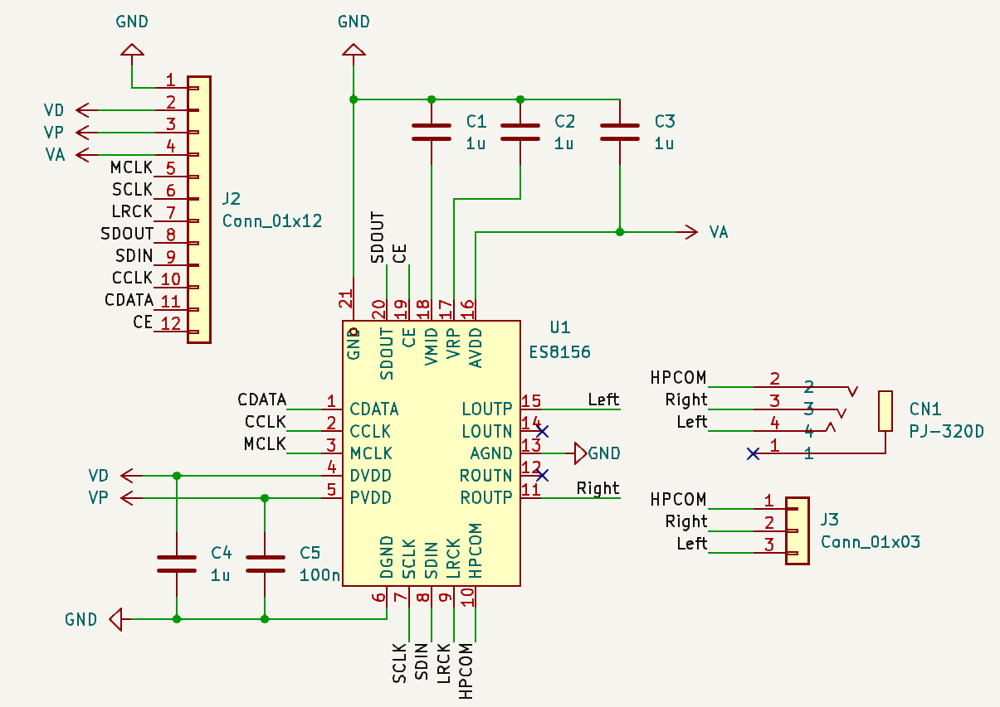
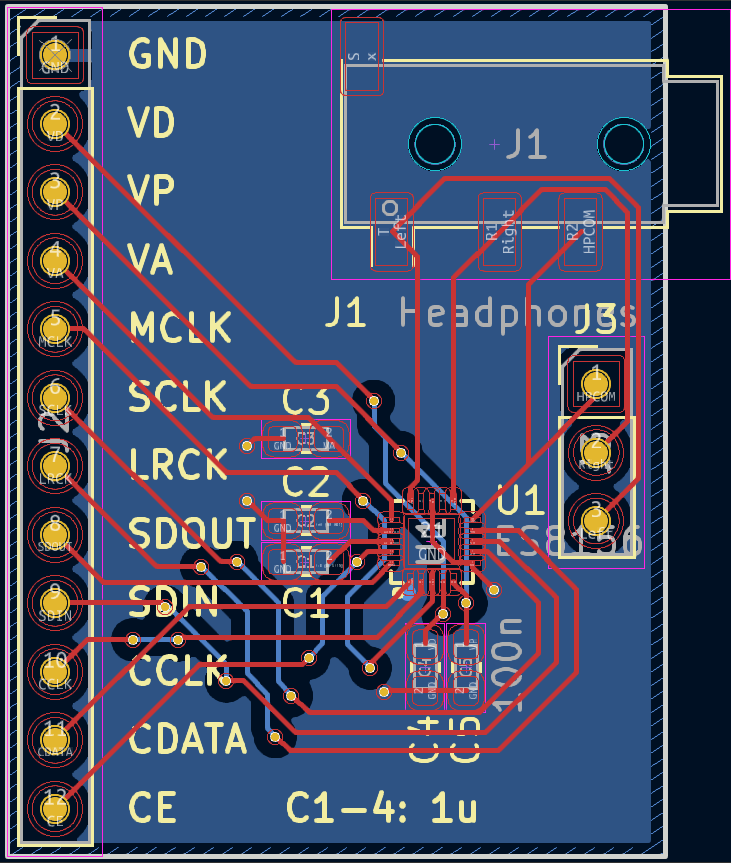

# ES8156 Breakout - *Untested*

Breakout PCB for the Everest Semiconductor [ES8156](http://www.everest-semi.com/pdf/ES8156%20PB.pdf), a DAC with integrated headphone driver.

----

Symbol and footprint generated with [easyeda2kicad.py](https://github.com/uPesy/easyeda2kicad.py):

`easyeda2kicad --full --lcsc_id=C2887138 --output ./lib/lcsc_parts`

----

